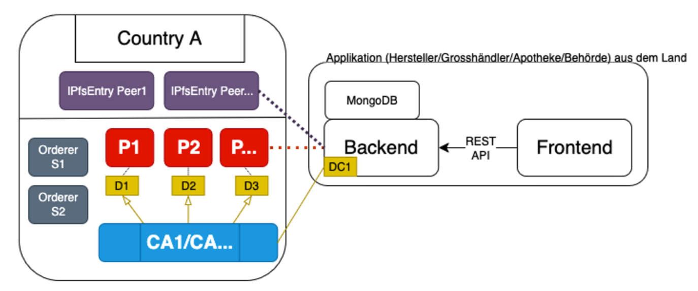
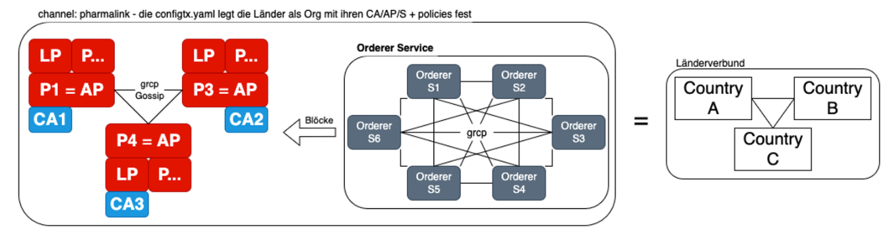
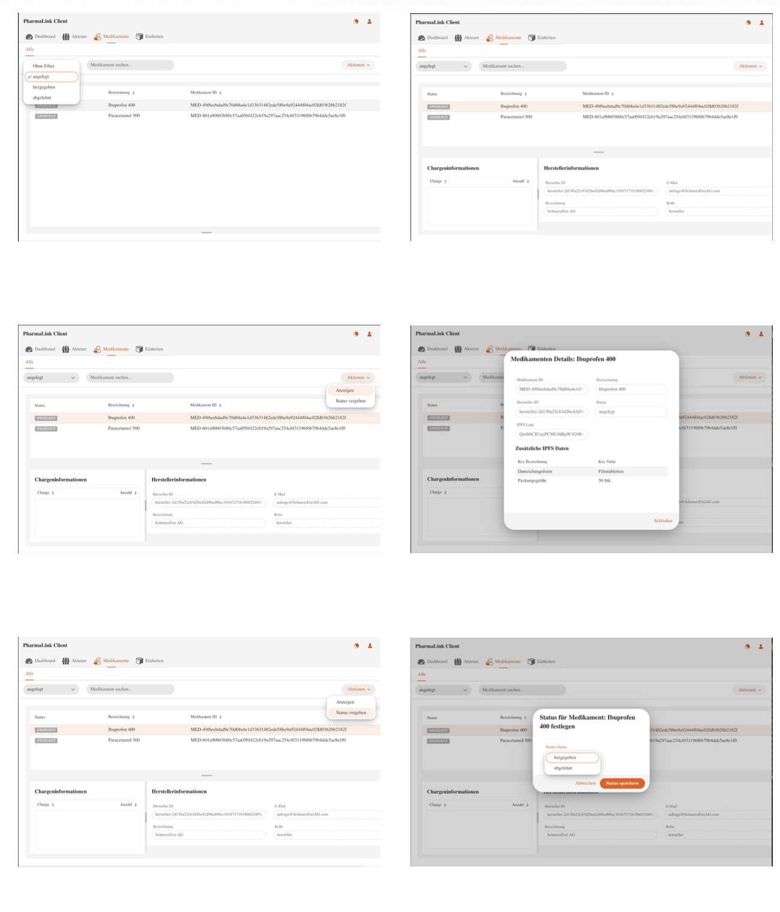
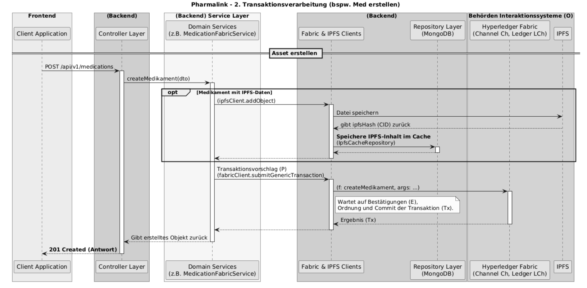

# Pharmalink
[](https://github.com/NiklasJavier/pharmalink/releases/latest)
[](https://github.com/NiklasJavier/pharmalink/pkgs/container/pharmalink)

## 🔹 Kurzübersicht
Pharmalink ist eine **Blockchain-basierte Test-Plattform** zur **Rückverfolgung von Medikamenten** entlang der Lieferkette (Hersteller → Großhändler → Apotheke → Behörde).  
Das System basiert auf **Hyperledger Fabric**, **Spring Boot** und **IPFS**.

<table>
  <tr>
    <td align="center">
      <a href="./docs/images/2_country-architecture_local.png">
        
      </a>
      <br/><sub><b>Architektur eines Landes</b></sub>
    </td>
    <td align="center">
      <a href="./docs/images/1_network-overview_countries.png">
        
      </a>
      <br/><sub><b>Länder-Detailübersicht</b></sub>
    </td>
  </tr>
  <tr>
    <td align="center">
      <a href="./docs/images/3_ui-medications.png">
        
      </a>
      <br/><sub><b>UI – Medikamente</b></sub>
    </td>
    <td align="center">
      <a href="./docs/images/4_transaction-sequence_med-create.png">
        
      </a>
      <br/><sub><b>Transaktionsablauf – Medikament erstellen</b></sub>
    </td>
  </tr>
</table>


---

### 🏗️ 1. Architektur

Die Plattform besteht aus drei Hauptkomponenten:

* **Spring Backend (`./src`):** Ein Java-basiertes Backend, das eine REST-API bereitstellt. Es dient als Schnittstelle für Benutzer und externe Systeme und kommuniziert per gRPC mit dem Hyperledger Fabric Netzwerk.
* **Spring Frontend (`./frontend/src`):** Eine auf Java sowie Vaadin-basiertes Frontend, um die Interaktionen visuell zu erläutern.
* **Chaincode (`./chaincode/pharmalink_chaincode_main`):** Der ChainCode, geschrieben in Java, der die gesamte Geschäftslogik enthält. Er definiert die Datenstrukturen (Assets) und die Regeln für deren Erstellung und Veränderung auf der Blockchain.
* **Hyperledger Fabric Test-Netzwerk (`./docker`, `./scripts`):** Eine Sammlung von Docker-Containern und Skripten, um eine lokale Blockchain-Umgebung mit mehreren Organisationen, Peers und einem Orderer zu starten und zu verwalten.

-----

### ⚙️ 2. Voraussetzungen einrichten

Bevor Sie mit dem Projekt beginnen, müssen einige grundlegende Tools auf Ihrem System installiert werden.

#### Docker Installation

```bash
curl -fsSL [https://get.docker.com](https://get.docker.com) -o get-docker.sh && sh get-docker.sh
```

#### Weitere Abhängigkeiten (Ubuntu)

```bash
sudo apt-get install curl git docker-compose zip jq -y
```

#### Zum Bauen (App + Chaincode)

Der empfohlene Weg zur Installation von Java ist **SDKMAN\!**.

```bash
# SDKMAN! installieren
curl -s "[https://get.sdkman.io](https://get.sdkman.io)" | bash

# SDKMAN! für die aktuelle Terminalsitzung laden
source "$HOME/.sdkman/bin/sdkman-init.sh"

# Java 11 für die Chaincodes installieren und als Standard festlegen
sdk install java 11.0.27-tem
sdk default java 11.0.27-tem

# Java 21 für die SpringBoot-Applikation installieren
sdk install java 21.0.7-tem
```

> 💡 **Hinweis:** Der Chaincode muss mit Java 11 gebaut werden, während die Applikation Java 21 benötigt. Wechsel bei Bedarf die Version mit `sdk use java ...`.

-----

### 🚀 3. Entwicklungsumgebung starten

Die folgenden Befehle klonen das Repository, richten das Fabric-Netzwerk ein, initialisieren den Chaincode und starten die Pharmalink-Anwendung. Führen Sie diesen Block als Ganzes aus.

```bash
cd ~ && sudo rm -rf ./pharmalink && \
git clone git@github.com:NiklasJavier/pharmalink.git && \
source /root/pharmalink/scripts/fabric_setEnv.sh && \
bash /root/pharmalink/scripts/fabric_setup_test.sh up && \
bash /root/pharmalink/scripts/fabric_setup_test.sh cc && \
bash /root/pharmalink/scripts/fabric_setup_test_consortium.sh && \
cd /root/pharmalink/scripts && \
bash /root/pharmalink/scripts/pharmalink_setup.sh up
```
##### Die Anwendung
| **Service**                             | **Endpoint**                  |
|-----------------------------------------|-------------------------------|
| Backend API                             | [http://localhost:8080](http://localhost:8080)         |
| Frontend                                | [http://localhost:3000](http://localhost:3000)         |
| IPFS Application                        | [http://localhost:5001](http://localhost:5001)         |
| PostgreSQL Database                     | `localhost:5432`              |

##### Die Infrastruktur
| **Service**                             | **Endpoint**                  |
|-----------------------------------------|-------------------------------|
| Hyperledger Peer                        | `localhost:9051`              |
| Hyperledger Orderer                     | `localhost:7050`              |
| Hyperledger Certificate Authority (CA)  | `localhost:9054`              |

-----

### 👥 4. Akteure im Netzwerk

Das Test-Netzwerk simuliert eine Lieferkette mit den folgenden vordefinierten Rollen und Organisationen. Sie können die Identität in Ihrer Kommandozeile jederzeit wechseln, indem Sie das entsprechende Skript ausführen.

| Akteur / Rolle | CLI-Skript |
| :--- | :--- |
| **Hersteller** | `source /root/pharmalink/scripts/roles/fabric_role_hersteller.sh` |
| **Großhändler**| `source /root/pharmalink/scripts/roles/fabric_role_grosshaendler.sh` |
| **Apotheke** | `source /root/pharmalink/scripts/roles/fabric_role_apotheke.sh` |
| **Behörde** | `source /root/pharmalink/scripts/roles/fabric_role_behoerde.sh` |

-----

### ⛓️ 5. Mit dem Chaincode per CLI interagieren

Nachdem das Netzwerk läuft, können Sie mit dem `peer`-CLI direkt mit dem Smart Contract interagieren. Stellen Sie sicher, dass Sie zuvor die passende Rolle mit einem der Skripte aus der obigen Tabelle gesetzt haben.

Eine detaillierte Beschreibung aller verfügbaren Chaincode-Funktionen und deren Parameter finden Sie in der [`README` des Chaincode-Verzeichnisses](./chaincode/README.md).

**Beispiel: `initCall`**

```bash
# Identität als Behörde setzen
source /root/pharmalink/scripts/roles/fabric_role_behoerde.sh

# Chaincode-Funktion aufrufen
peer chaincode invoke -o $ORDERER_ADDRESS --tls --cafile $ORDERER_CA -C $CHANNEL_NAME -n $CHAINCODE \
--peerAddresses $PEER0_ORG1_ADDRESS --tlsRootCertFiles $PEER0_ORG1_CA \
--peerAddresses $PEER0_ORG2_ADDRESS --tlsRootCertFiles $PEER0_ORG2_CA \
-c '{"function":"initCall","Args":[""]}'
```

-----

### 🛑 6. Umgebung zurücksetzen und löschen

Um alle Docker-Container zu stoppen, das erstellte Netzwerk zu bereinigen und das Repository zu entfernen, verwenden Sie das `repo_reset.sh`-Skript.

```bash
cd /root/pharmalink/scripts/manage && bash ./repo_reset.sh
```